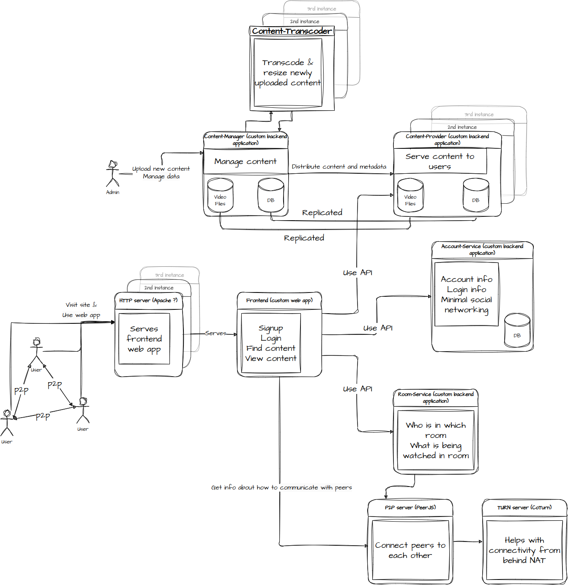

# FLMnCHLL (Film-and-Chill)

Video streaming service where a small group of users can watch a video synchronously.
Users can pause the video, and the stream will be paused for everyone.
There will be a text chat feature to discuss the video/whatever.
There will be a voice chat feature to discuss the video/whatever.

## Pre-requisites
1. `docker`
2. `docker-compose`
3. `bash`
4. `npm`

## Building
1. `./build.sh`
2. `docker compose up`
3. Build and run frontend in a separate window: `cd frontend; npm run dev`
   - May need to install dependencies first by running `npm install` in `frontend` directory

## Running
### Upload content
Open `http://localhost:8080` in your browser
Use the form to upload some `mp4` or `webm` video.

You will see in container logs that `content-manager` received the file and launched some transcoding and downscaling jobs.

```
flmnchll-content-manager-1     | 2023/03/12 16:43:20 processing uploaded video with id 8682c316-0fc9-4f01-8444-5da0cf25e359
flmnchll-content-manager-1     | 2023/03/12 16:43:20 submitting downscaling job with id: 040bd582-6df0-49f1-9e30-ee9bb5ab46ca
flmnchll-content-manager-1     | 2023/03/12 16:43:20 submitting downscaling job with id: f0d98021-a492-48cc-bb00-0caa99b88610
flmnchll-content-manager-1     | 2023/03/12 16:43:20 submitting transcoding job with id: c8c34591-41e1-436a-8e9b-748959a5dcca

```

Note down the content id from the "processing uploaded video with id ..." line.

## Required configuration
Create a password for Redis and place it in `./conf/redis_password.env` like so:
```console
mypassword="supersecret"; echo "REDIS_PASSWORD=${mypassword}" > ./conf/redis_password.env
```

Create an internal API token for account service and place it in `./conf/account_service_secret.env` like so:
```console
token="mysecrettoken"; echo "account_service_internal_api_secret=${token}" > ./conf/account_service_secret.env
```
This is a shared secret used for internal communication by FLMnCHLL services. Don't expose it publicly.

## Detailed description

### Components


- Frontend (web app probably most useful, desktop version would be cool too)
    - signup (account-service)
    - login (account-service)
    - listing of available content (content-provider)
    - create room (room-service)
    - join room (room-service)
    - select content to watch (with voting option?) (room-service)
    - watch video (`<video>` using content-provider)
    - text chat (PeerJS)
    - voice comms (PeerJS)
    - video player controls (play/pause/rewind) (PeerJS)
- Content delivery component (full-blown CDN out of scope)
- Peer server (PeerJS)
    * Chat service (many-to-many text chat)
    * VoIP service (many-to-many calls)
    * Signaling service (synchronized play-pause)
- Monitoring
    * usage
        + total views
        + views per video
        + DAU
        + MAU
        + total users
    * uptime/service status
    * 
- Login/Auth service (account-service)
- Room service managing group viewing sessions (room-service)
- STUN/TURN server (coturn)
- Content management service (upload/metadata editing) (content-manager)
    - admin UI?
    - console app?
    - thumbnails
- Content viewing service (browse/download video) (content-provider)
- Transcoding service (arbitrary source format to {mp4, webm})

Can implement chat & signaling (and voip probably) with PeerJS.

#### frontend
Frontend will be a web application running in a browser.

It will be built using React+Typescript+Vite.

Frontend handles synchronization across peers.

#### account-service
Used for login, request authentication, etc.

#### room-service
Room must have associated PeerJS server.
Room keeps track of users in it
Should be possible to password/pin protect a room to prevent randoms joining.
Room keeps info about what is being watched, tracks progress

#### content-manager
When video in `webm` format is uploaded, trigger `content-transcoder` service to transcode it to `mp4`.
When video in `mp4` format is uploaded, trigger `content-transcoder` service to transcode it to `webm`.
Also trigger downscaling jobs as needed.

#### content-provider
Subtitles?

#### content-transcoder
Automatically downscale & transcode video files.
There should be a work queue where content-transcoder instances can get jobs from.
Work queue could be a [redis `list`](https://redis.io/docs/data-types/lists/).

We probably want 480p, 720p, 1080p, (2160p) versions.
Also want mp4 and webm version of each video.

When conversion is ready, `content-manager` should be told about it.

Input file should be downscaled to any missing resolution below the original resolution.
Upscaling is not necessary.

Content transcoder container needs read access to the work queues from redis.
At least one container should be running transcoding jobs.
At least one container should be running downscaling jobs.